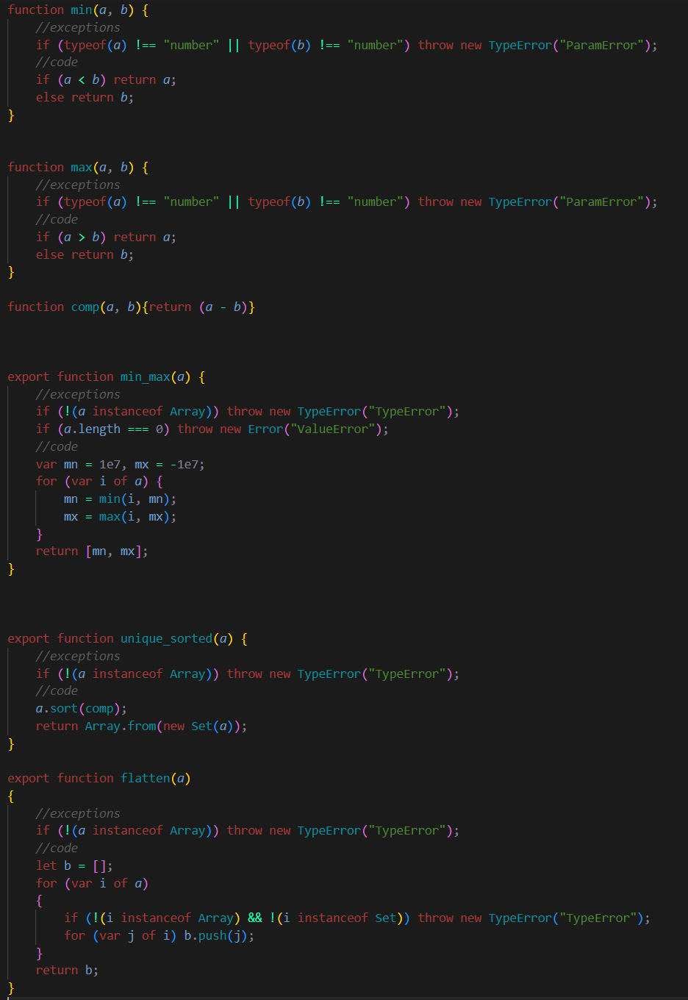
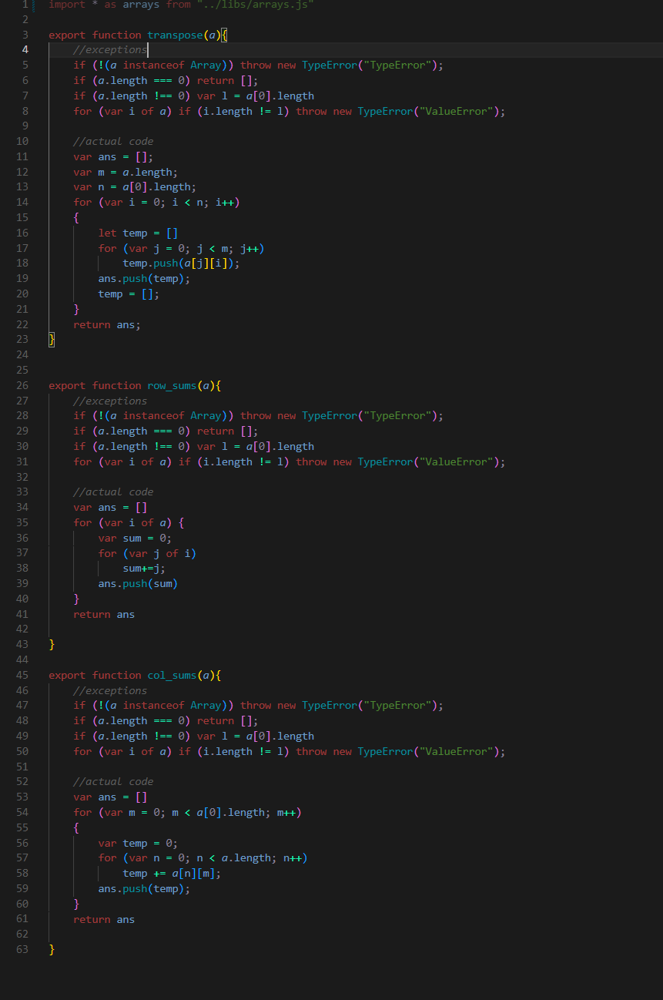
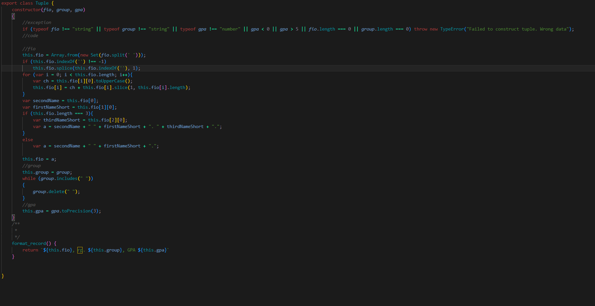

# Обзор на все мое написанное
# Arrays

Сначала я релизовал функции min и max для удобства, потом самым тупым образов реализовал функции и все
# Matrixes

transpose реализовал через банальную зеркализацию индексов i и j идя по изначальной матрице, а row_sums и col_sums через соответственно полный обход матрицы в тупую
# Tuples

Реализовал ООП'шный подход к проблеме отсутствия в js класса tuple как такового, соответственно создал свой, поддерживающий в качестве своих полей 3 вещи: полные ФИО жертвы, ее группу и GPA. При попощи метода format_record можно получить их удобно в формате строки