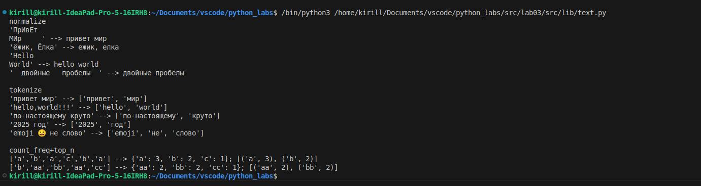
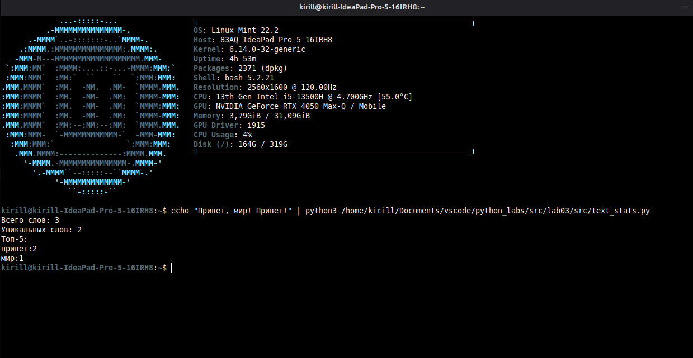

# Ниже я приведу примеры функционирования моих замечательных функций корректно при любых корректных входных данных

# Ниже я приведу пример абсолютно корректного функционирования реквеста


# Дальше пойдет страшный некрасивый код и то что я тут писал ваще
```python
def normalize(text: str, *, casefold: bool = True, yo2e: bool = True) -> str:
    if casefold: text = text.casefold()
    if yo2e: text = text.replace('ё', 'е').replace('Ё', 'е')
    text = re.sub(r"\s+", " ", text) # r"\s+" is a regexp for all special characters like \n, \t etc.
    text = text.strip()
    return text
```
Тут мне кажется говорить что-то будет излишне, все и так понятно, даже комментарий написал специально чтобы 100% без вопросов было

```python
def tokenize(text: str) -> list[str]:
    regexp = r"[^\w-]" # r"[^\w-]" is a regexp for all characters EXCEPT for letters, numbers and '-'
    text = normalize(re.sub(regexp, " ", text))
    return text.split(' ')
```
Тут опять же самое сложное это регэксп, к которому я уже дал комментарий

```python
def count_freq(tokens: list[str]) -> dict[str, int]:
    freq = dict()
    for token in tokens:
        try: 
            freq[token] += 1
        except:
            freq[token] = 1
    return dict(sorted(freq.items(), key=lambda item: (-item[1], item[0])))
```
Тут может понадобиться немного объяснений, трай-кетч нужен, чтобы я мог спокойно делать += 1 и питон не ругался на то что я к ничему 1 прибавляю, поэтому когда я так пытаюсь сделать, я наоборот назначаю единичку (логично). Ретерн тоже достаточно банальный, а просто сорчу все элементы словоря по количеству (от большего к меньшему) и после этого 2 приоритетом ставлю алфавитную очередность

```python
def top_n(freq: dict[str, int], n: int = 5) -> list[tuple[str, int]]:
    temp = []
    cnt = 0
    for token in freq.items():
        temp.append(token)
        cnt += 1
        if (cnt == n or cnt == len(freq)): break
    return temp
```

Ну тут совсем нечего говорить

```python
import sys
import lib.text as text
string = sys.stdin.readline()
tokenized = text.tokenize(string)
unique_words = text.count_freq(tokenized)
print(f"Всего слов: {len(tokenized)}")
print(f"Уникальных слов: {len(unique_words)}")
n = 5
print(f"Топ-{n}:")
k = text.top_n(unique_words)
#wordlens = []
#for i in k:
#    wordlens.append(len(i[0]))
#max_word_len = max(wordlens)
for token in k:
    print(token[0] + ":" + str(token[1]))
```
Тут кажется тоже все супер фришно просто делаю пока делается, в комменте была попытка организовать табличный способ вывода, но не пошло