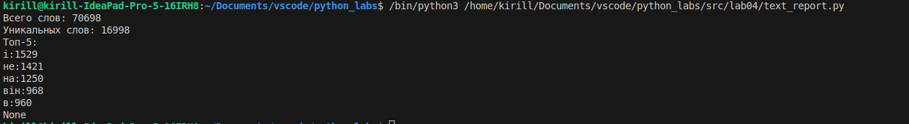
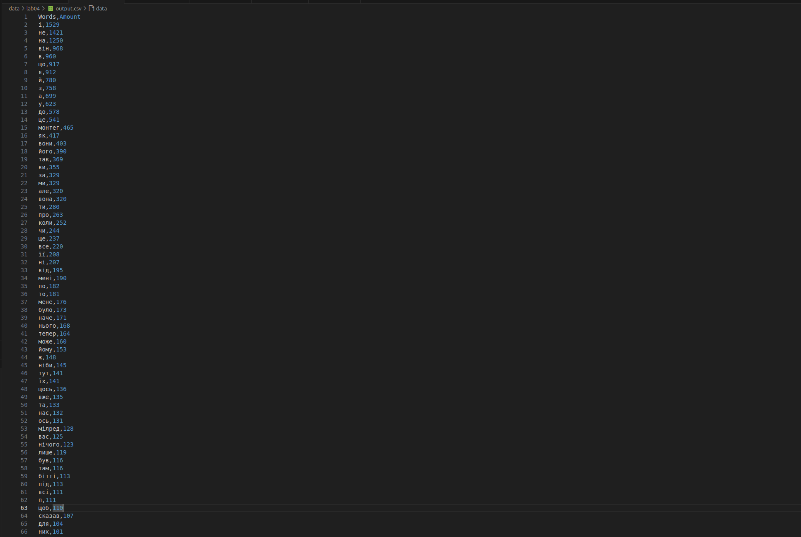

# Представляю вам лабу 04
Было оч интересно, мне очень понравилось
Итоговый код выглядит следующим образом:
# Внутрияшки
```python
from csv import writer
import sys
import os
import pathlib
sys.path.insert(0, os.path.dirname(os.path.dirname(os.path.abspath(__file__))))


def read_text(path: str | pathlib.Path, encoding: str = "utf-8") -> str:
    with open(path, 'r', encoding=encoding) as file:
        content = file.read()
    return content

def write_csv(rows: list[tuple | list], path: str | pathlib.Path, header: tuple[str, ...] | None = None) -> None:
    with open(path, 'w', newline="") as file:
        w= writer(file)
        if (header != None): w.writerows(header)
        w.writerows(rows)

```
Достаточно втупую написаны обе функции, особо не усложнял их, из-за этого приходится достаточно много морочиться с аргументами, которые в них передаю, но в целом все достаточно прямолинейно

# Как с этим работать?
```python
from pathlib import Path
import sys
import os
sys.path.insert(0, os.path.dirname(os.path.dirname(os.path.abspath(__file__))))
import io_text_csv
import libs.text

path = Path('/home/kirill/Documents/vscode/python_labs/data/lab04/input.txt')

txt = io_text_csv.read_text(path=path)
print(libs.text.summarize(txt))
#print(libs.text.count_freq(libs.text.tokenize(libs.text.normalize(txt))).items())
io_text_csv.write_csv(libs.text.count_freq(libs.text.tokenize(libs.text.normalize(txt))).items(), path='/home/kirill/Documents/vscode/python_labs/data/lab04/output.csv', header=[['Words', 'Amount']])
```
С чем мы непосредственно тут иеем дело. Для начала существует переменная ```path```, в которой хранится путь в нашему файлу с входными данными, его мы обрабатываем сразу а не построчно, что не оптимально для больших файлов, но для наших целей сойдет, далее при помощи замечательной функции ```summarize``` выводится краткая статистика по тексту. Функция ```io_text_csv.write_csv``` принимает в себя список пар формата (ключ, значение) полученных из словаря, созданного по тексту, потом выбирается путь, место, куда записать возвращаемое значение и заголовок в *2* квадратных скобках (это обязательно). На выходе мы получаем по указанному нами адресу .csv табличку, в которой будет список всех слов и количество их использований в тексте

# На этом у меня все, потрачено времени +-5.5 часов, так что все круто, ниже будут скрины работы кода на примере рассказа "451 градус по Фаренгейту" (к сожалению я нашел только на украинском)


К моему удивлению код пронесся по тексту весом почти в мегабайт за доли секунды, что круто