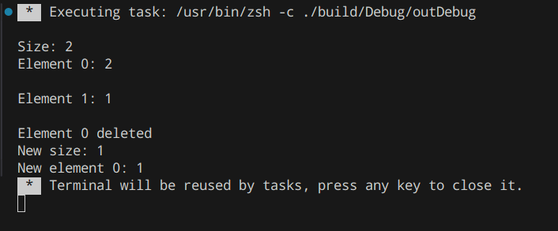

# Лабораторная работа №10
Я ее писал на my second favourite япе C++, потому что все, где нужны указатели я не буду писать на япе, где явных указателей нет. 
# Linked list
Линкед лист (связный список) — одна из простейшних структур данных на указателях. 
```c++ 
#include <bits/stdc++.h>
#include <string>
using namespace std;

class Int
{
 private:
    int value;
    bool correct;

 public:
    Int()
    {
        value = 0;
        correct = false;
    }
    Int(int _value)
    {
        value = _value;
        correct = true;
    }
    int getValue() const
    {
        return value;
    }
    bool isCorrect() const
    {
        return correct;
    }
};

ostream& operator<<(ostream& out, const Int& value)
{
    if (value.isCorrect())
    {
        out << value.getValue() << endl;
    }
    else
    {
        out << "error" << endl;
    }
    return out;
}

class Element
{
 public:
    int value;
    Element* next;

 public:
    Element(int _value, Element* _next)
    {
        value = _value;
        next = _next;
    }
    int getValue() const
    {
        return value;
    }
    Element* getNext() const
    {
        return next;
    }
    void setNext(Element* newNext)
    {
        next = newNext;
    }
};

class LinkedList
{
 private:
    Element* head;
    int size;
    Int insert(int number, int index)
    {
        if (index > size || index < 0)
        {
            return Int(-1e20);
        }
        Element* prevElement = head;
        for (int i = 0; i < index - 1; ++i)
        {
            prevElement = prevElement->getNext();
        }
        if (size != 0 && index != 0)
        {
            Element* newElem = new Element(number, prevElement->getNext());
            prevElement->setNext(newElem);
        }
        else
        {
            Element* newElem = new Element(number, head);
            head = newElem;
        }
        size++;
        return Int(number);
    }
 public:
    LinkedList()
    {
        head = nullptr;
        size = 0;
    }
    ~LinkedList()
    {
        Element* currElement = head;
        while (currElement)
        {
            Element* tmp = currElement->getNext();
            delete currElement;
            currElement = tmp;
        }
    }

    
    Int append(int number)
    {
        return insert(number, size);
    }
    Int prepend(int number)
    {
        return insert(number, 0);
    }
    Int deleteAt(int index)
    {
        if (index >= size || size == 0 || index < 0)
        {
            return Int();
        }
        int prevValue = 0;
        if (index != 0)
        {
            Element* prevElement = head;
            for (int i = 0; i < index - 1; ++i)
            {
                prevElement = prevElement->getNext();
            }
            Element* elem = prevElement->getNext();
            prevElement->setNext(elem->getNext());
            prevValue = elem->getValue();
            delete elem;
        }
        else
        {
            Element* elem = head;
            head = elem->getNext();
            prevValue = elem->getValue();
            delete elem;
        }
        size--;
        return Int(prevValue);
    }

    Int element(int index)
    {
        if (index >= size || size == 0 || index < 0)
        {
            return Int();
        }
        else
        {
            Element* elem = head;
            for (int i = 0; i < index; ++i)
            {
                elem = elem->getNext();
            }
            return Int(elem->getValue());
        }
    }

    int getSize()
    {
        return size;
    }
    void clear()
    {
        head = nullptr;
        size = 0;
    }
};

int main()
{
    LinkedList list;
    list.append(1);
    list.prepend(2);
    cout << "Size: " << list.getSize() << "\n";
    cout << "Element 0: " << list.element(0) << " Element 1:" << list.element(1) << "\n";
    list.deleteAt(0);
    cout << "Element 0 deleted\n";
    cout << "New size: " << list.getSize() << "\n";
    cout << "New element 0: " << list.element(0);
    return 0; 
}
```
Код был написан мной в непосредственно 2021 году и слегка модифицирован под условие Lab10, в связи с чем я не до конца понимаю зачем мне нужен был класс ```Int```, но что имеем то имеем. Реализован класс ```Element```  c полями значения и указателя на следующий элемент. В самом классе ```LinkedList``` так же ничего сложного нет, есть приватная функция ```Insert``` которая управляет всеми вставками элементов, но так как по ТЗ нам надо только аппендить и препендить, я сделал методы-обертки для нее. Также реализованы функции удаления элемента по индексу, получение размера связного списка, его очистка и получение значения элемента по индексу. 

Запуск кода выводит следующий результат:



# Stack
```c++
#include <iostream>
#include <string>
using namespace std;

class Int
{
 private:
    int value;
    bool correct;

 public:
    Int()
    {
        value = 0;
        correct = false;
    }
    Int(int _value)
    {
        value = _value;
        correct = true;
    }
    int getValue() const
    {
        return value;
    }
    bool isCorrect() const
    {
        return correct;
    }
};

ostream& operator<<(ostream& out, const Int& value)
{
    if (value.isCorrect())
    {
        out << value.getValue() << endl;
    }
    else
    {
        out << "error" << endl;
    }
    return out;
}

class Element
{
 public:
    int value;
    Element* next;
    Element* prev;

 public:
    Element(int _value, Element* _next, Element* _prev)
    {
        value = _value;
        next = _next;
        prev = _prev;
    }
    int getValue() const
    {
        return value;
    }
    Element* getNext() const
    {
        return next;
    }
    Element* getPrev() const
    {
        return prev;
    }
    void setNext(Element* newNext)
    {
        next = newNext;
    }
    void setPrev(Element* newNext)
    {
        prev = newNext;
    }
};

class DoubleLinkedList
{
 private:
    Element* back;
    Element* head;
    int size;

 public:
    DoubleLinkedList()
    {
        head = nullptr;
        back = nullptr;
        size = 0;
    }
    ~DoubleLinkedList()
    {
        Element* currElement = head;
        while (currElement)
        {
            Element* tmp = currElement->getNext();
            delete currElement;
            currElement = tmp;
        }
    }

    Int insert(int number, int index)
    {
        if (index > size || index < 0)
        {
            return Int();
        }
        Element* prevElement = head;
        for (int i = 0; i < index - 1; ++i)
        {
            prevElement = prevElement->getNext();
        }
        if (size != 0 && index != 0)
        {
            if (index == size)
            {
                Element* elem = new Element(number, nullptr, back);
                back->setNext(elem);
                back = elem;
            }
            else
            {
                Element* elem = new Element(number, prevElement->getNext(), prevElement);
                prevElement->setNext(elem);
                Element* element = prevElement->getNext();
                element->setPrev(elem);
            }
        }
        else if (index == 0 && size == 0)
        {
            Element* elem = new Element(number, nullptr, nullptr);
            head = elem;
            back = elem;
        }
        else
        {
            Element* elem = new Element(number, head, nullptr);
            head->setPrev(elem);
            head = elem;
        }
        size++;
        return Int(number);
    }

    Int Delete(int index)
    {
        if (index >= size || size == 0 || index < 0)
        {
            return Int();
        }
        int prevValue = 0;
        if (index != 0 && index != size - 1)
        {
            Element* prevElement = head;
            for (int i = 0; i < index - 1; ++i)
            {
                prevElement = prevElement->getNext();
            }
            Element* elem = prevElement->getNext();
            Element* nextElement = elem->getNext();

            prevElement->setNext(elem->getNext());
            nextElement->setPrev(prevElement);
            prevValue = elem->getValue();
            delete elem;
        }
        else if (index == size - 1 && index != 0)
        {
            Element* elem = back;
            back = elem->getPrev();
            back->setNext(nullptr);
            prevValue = elem->getValue();
            delete elem;
        }
        else if (index == 0 && size != 1)
        {
            Element* elem = head;
            head = elem->getNext();
            head->setPrev(nullptr);
            prevValue = elem->getValue();
            delete elem;
        }
        else if (index == 0 && size == 1)
        {
            prevValue = head->getValue();
            head = nullptr;
            back = nullptr;
            delete head;
        }
        size--;
        return Int(prevValue);
    }

    int getSize()
    {
        return size;
    }
    void clear()
    {
        back = nullptr;
        head = nullptr;
        size = 0;
    }
    int Back()
    {
        return back->getValue();
    }
    int Front()
    {
        return head->getValue();
    }
};

class Deque
{
 private:
    DoubleLinkedList deque;
 public:
    void push_front(int number)
    {
        deque.insert(number, 0);
    }
    void push_back(int number)
    {
        deque.insert(number, deque.getSize());
    }
    Int pop_front()
    {
        if (deque.getSize() == 0)
        {
            return Int();
        }
        else
        {
            return deque.Delete(0);
        }
    }
    Int pop_back()
    {
        if (deque.getSize() == 0)
        {
            return Int();
        }
        else
        {
            return deque.Delete(deque.getSize() - 1);
        }
    }
    Int front()
    {
        if (deque.getSize() == 0)
        {
            return Int();
        }
        else
        {
            return Int(deque.Front());
        }
    }
    Int back()
    {
        if (deque.getSize() == 0)
        {
            return Int();
        }
        else
        {
            return Int(deque.Back());
        }
    }
    int size()
    {
        return deque.getSize();
    }
    void clear()
    {
        deque.clear();
    }
};
class Stack
{
 private:
    Deque deque;
 public:
    void push(int number)
    {
        deque.push_back(number);
    }
    Int pop()
    {
        return deque.pop_back();
    }
    Int peek()
    {
        return deque.back();
    }
    int stackSize()
    {
        return deque.size();
    }
    void stackClear() {
        deque.clear();
    }
};
```
Класс ```Stack``` я реализовывал основываясь на дабл-эндед-къю (что по сути просто очередь, но работающая в обе стороны, то есть можно за О(1) получить первый/последний элемент и за те же О(1) добавить элемент в начало или в конец).  Тут в целом все очев, разглагольствовать неочем. 

# Queue
```c++
 #include <bits/stdc++.h>
#include <string>
using namespace std;

class Int
{
 private:
    int value;
    bool correct;

 public:
    Int()
    {
        value = 0;
        correct = false;
    }
    Int(int _value)
    {
        value = _value;
        correct = true;
    }
    int getValue() const
    {
        return value;
    }
    bool isCorrect() const
    {
        return correct;
    }
};

ostream& operator<<(ostream& out, const Int& value)
{
    if (value.isCorrect())
    {
        out << value.getValue() << endl;
    }
    else
    {
        out << "error" << endl;
    }
    return out;
}

class Element
{
 public:
    int value;
    Element* next;
    Element* prev;

 public:
    Element(int _value, Element* _next, Element* _prev)
    {
        value = _value;
        next = _next;
        prev = _prev;
    }
    int getValue() const
    {
        return value;
    }
    Element* getNext() const
    {
        return next;
    }
    Element* getPrev() const
    {
        return prev;
    }
    void setNext(Element* newNext)
    {
        next = newNext;
    }
    void setPrev(Element* newNext)
    {
        prev = newNext;
    }
};

class DoubleLinkedList
{
 private:
    Element* back;
    Element* head;
    int size;

 public:
    DoubleLinkedList()
    {
        head = nullptr;
        back = nullptr;
        size = 0;
    }
    ~DoubleLinkedList()
    {
        Element* currElement = head;
        while (currElement)
        {
            Element* tmp = currElement->getNext();
            delete currElement;
            currElement = tmp;
        }
    }

    Int insert(int number, int index)
    {
        if (index > size || index < 0)
        {
            return Int(-1e20);
        }
        Element* prevElement = head;
        for (int i = SinglyLinkedList0; i < index - 1; ++i)
        {
            prevElement = prevElement->getNext();
        }
        if (size != 0 && index != 0)
        {
            if (index == size)
            {
                Element* elem = new Element(number, nullptr, back);
                back->setNext(elem);
                back = elem;
            }
            else
            {
                Element* elem = new Element(number, prevElement->getNext(), prevElement);
                prevElement->setNext(elem);
                Element* element = prevElement->getNext();
                element->setPrev(elem);
            }
        }
        else if (index == 0 && size == 0)
        {
            Element* elem = new Element(number, nullptr, nullptr);
            head = elem;
            back = elem;
        }
        else
        {
            Element* elem = new Element(number, head, nullptr);
            head->setPrev(elem);
            head = elem;
        }
        size++;
        return Int(number);
    }

    Int Delete(int index)
    {
        if (index >= size || size == 0 || index < 0)
        {
            return Int();
        }
        int prevValue = 0;
        if (index != 0 && index != size - 1)
        {
            Element* prevElement = head;
            for (int i = 0; i < index - 1; ++i)
            {
                prevElement = prevElement->getNext();
            }
            Element* elem = prevElement->getNext();
            Element* nextElement = elem->getNext();

            prevElement->setNext(elem->getNext());
            nextElement->setPrev(prevElement);
            prevValue = elem->getValue();
            delete elem;
        }
        else if (index == size - 1 && index != 0)
        {
            Element* elem = back;
            back = elem->getPrev();
            back->setNext(nullptr);
            prevValue = elem->getValue();
            delete elem;
        }
        else if (index == 0 && size != 1)
        {
            Element* elem = head;
            head = elem->getNext();
            head->setPrev(nullptr);
            prevValue = elem->getValue();
            delete elem;
        }
        else if (index == 0 && size == 1)
        {
            prevValue = head->getValue();
            head = nullptr;
            back = nullptr;
            delete head;
        }
        size--;
        return Int(prevValue);
    }

    int getSize()
    {
        return size;
    }
    void clear()
    {
        back = nullptr;
        head = nullptr;
        size = 0;
    }
    int Back()
    {
        return back->getValue();
    }
    int Front()
    {
        return head->getValue();
    }
};

class Deque
{
 private:
    DoubleLinkedList deque;
 public:
    void push_front(int number)
    {
        deque.insert(number, 0);
    }
    void push_back(int number)
    {
        deque.insert(number, deque.getSize());
    }
    Int pop_front()
    {
        if (deque.getSize() == 0)
        {
            return Int();
        }
        else
        {
            return deque.Delete(0);
        }
    }
    Int pop_back()
    {
        if (deque.getSize() == 0)
        {
            return Int();
        }
        else
        {
            return deque.Delete(deque.getSize() - 1);
        }
    }
    Int front()
    {
        if (deque.getSize() == 0)
        {
            return Int();
        }
        else
        {
            return Int(deque.Front());
        }
    }
    Int back()
    {
        if (deque.getSize() == 0)
        {
            return Int();
        }
        else
        {
            return Int(deque.Back());
        }
    }
    int size()
    {
        return deque.getSize();
    }
    void clear()
    {
        deque.clear();
    }
};

class Queue
{
    private:
        Deque queue;
    public:
        void enqueue(int number)
        {
            queue.push_back(number);
        }
        Int dequeue()
        {
            return queue.pop_front();
        }
        Int peek()
        {
            return queue.front();
        }
        Int size()
        {
            return queue.size();
        }
}
```
Тут в целом тоже нечего говорить, просто урезанная версия даблэндед очереди, как и стек